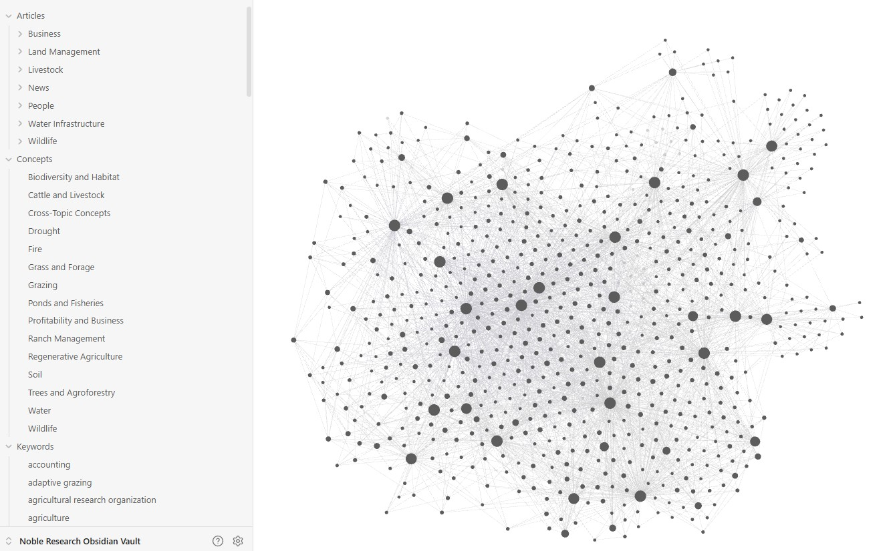
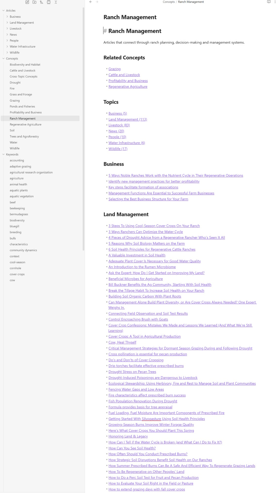

# Noble Research Obsidian Vault

## Attribution & Disclaimer

All articles and content within this repository are the sole property of Noble Research Institute. I do not claim ownership of any materials shared here; this repository serves exclusively as a personal collection for archival/educational purposes.

- **Original Source:** https://www.noble.org/articles/
- **Original Website:** https://www.noble.org/

## Getting Started

The vault is free to use and doesn't require any paid plugins.

1. Install [Obsidian](https://obsidian.md) (free)
2. Clone or download the repository: https://github.com/mktcowboy/noble-research-obsidian-vault
3. Open Obsidian → "Open folder as vault" → select the downloaded folder
4. Start from the **Start Here** note

## Contents

- Start Here.md is the main entry note.
- Articles contains only article notes, organized by topic.
- Maps/Topics contains topic overview notes and Maps/Sections contains section browse notes.
- .obsidian/core-plugins.json stores the tracked Obsidian core plugin configuration for the vault.

## Screenshots

**Graph view** — all 540 articles connected through shared concepts and keywords:

**Concept view** — browsing articles linked to a single concept across all topics:

## Notes

- Each article note includes frontmatter with source URLs, topic metadata, categorized browse metadata and scraped tags.
- Topic overview notes use the source `by_topic` structure where it helps sort articles inside each topic.
- Obsidian workspace-specific files are ignored so local UI state does not clutter version control.

## Quartz Website

This repository now includes a Quartz site in [site](/Users/blake/Desktop/github/noble-research-obsidian-vault/site).

